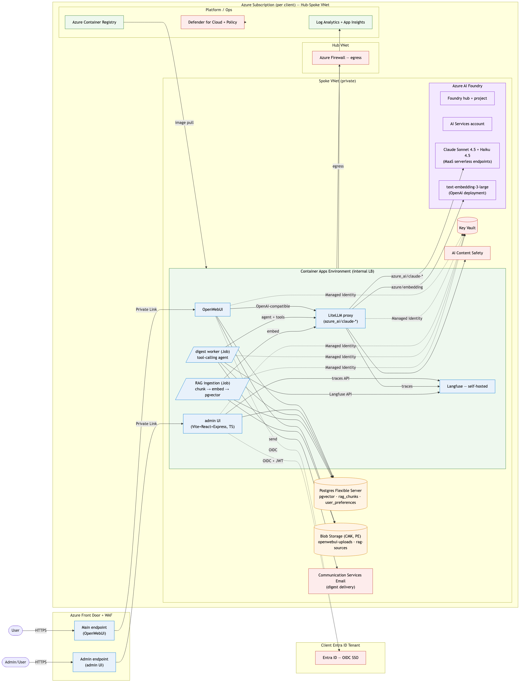

<!-- _class: lead -->

# OpenWebUI on Azure
### A repeatable, closed-environment foundation for client chatbots

*Architecture · Infrastructure · Delivery · Ways of working*

~15 min + Q&A

---

<!-- _class: lead -->

## Note — this is the v1 design-review deck

It captures the original architecture we walked through with Andreas.
Since then the implementation has evolved:

- **Model layer:** Azure OpenAI (GPT-4o) → **Azure AI Foundry + Claude Sonnet/Haiku 4.5 (MaaS)**
- **Digest summariser:** single prompt → **tool-calling Claude agent** (Langfuse-traced)
- **RAG:** OpenWebUI's built-in → **custom ingestion pipeline** (Blob → chunk → embed → pgvector with HNSW)
- **New:** TypeScript/React admin UI on a dedicated Front Door endpoint, Entra SSO, runtime config
- **CI/CD:** ADO pipelines shipped + live-deployed; Managed DevOps Pools scaffolded for VNet-injected agents
- **Cost guardrails:** budget + action group + Automation runbook killswitch for dev subs

Current architecture diagram + details in the repo `README.md`. The rest
of this deck is retained for the original reasoning and trade-offs.

---

<!-- _class: lead -->

## Real-world deploy notes

Lessons from bootstrapping the stack end-to-end (~30 iteration cycles
of apply-fix-apply against real Azure):

- **Paid sub required.** Trial subs block Postgres Flexible, Front Door Premium, and Claude MaaS — not fixable via quota request.
- **Storage AAD data-plane.** `shared_access_key_enabled = false` means `storage_use_azuread = true` + explicit `Storage Blob/Queue Data` role grants on the SA.
- **WIF → Terraform backend.** `az login` from `AzureCLI@2` ≠ authenticating the terraform azurerm backend. Map `$idToken` → `ARM_OIDC_TOKEN`.
- **ADO parallelism is separately billed.** Upgrading the Azure sub doesn't grant hosted pipeline jobs. Buy, self-host, or wait for the free-grant form.
- **Stale tfstate locks.** Cancelled pipeline runs leave locks. `az storage blob lease break` clears them in seconds.

All six fixes shipped as PRs against `main` — see `README.md`'s "Deploy
gotchas" section for the running list.

---

## 1 · Framing

**The ask:** a generic chatbot foundation, deployable per client, that becomes the base for their AI initiatives.

**Constraints:**
- Runs entirely on Azure — closed, secure data plane
- Infra + app fully scripted
- CI/CD for infra changes, new models, and bug fixes

**My design stance:**
- Boring defaults, platform-native services
- One template → many clients, parameterised not forked
- Optimise for *iteration speed on prompts and models*, not infra heroics

---

## 2 · Target architecture



<!--
Speaker notes:
- Everything behind Front Door + WAF; origin is private.
- OpenWebUI runs as a stateless container; Postgres holds state + vectors.
- LiteLLM is the single OpenAI-compatible endpoint OpenWebUI talks to — lets us swap/route models without touching the app.
- Langfuse is the LLM observability plane — self-hosted so traces never leave the tenant.
-->

---

## 2 · Architecture — component choices

| Layer | Choice | Why this, not that |
|---|---|---|
| Ingress | **Front Door + WAF** | TLS, OWASP, DDoS; private origin |
| Identity | **Entra ID OIDC** + Managed Identities | SSO per client tenant, no app secrets |
| Compute | **Azure Container Apps** (internal, VNet) | Right-sized; revisions + canary; no K8s tax |
| State DB | **Postgres Flexible Server** (private) | OpenWebUI first-class support |
| Vectors | **pgvector** → escalate to **Azure AI Search** | Start simple; upgrade when retrieval demands |
| LLM | **Azure OpenAI** + **LiteLLM** proxy *(shipped as: Azure AI Foundry + Claude MaaS + LiteLLM)* | One endpoint for OpenWebUI, many models behind it |
| Files | **Blob Storage** (private endpoint, CMK) | RAG sources + uploads |
| Secrets | **Key Vault** + Managed Identity | Zero secrets in pipelines/app |
| Obs (infra) | **Log Analytics + App Insights** | Native, alert rules as code |
| Obs (LLM) | **Langfuse** (self-hosted Container App) | Traces, token cost, eval gates |
| Network | Hub-spoke VNet, Private Endpoints, **Azure Firewall** egress | Satisfies "closed environment" |

---

## 2 · Architecture — key trade-offs

**Container Apps vs AKS**
- AKS only if the client already runs K8s. Otherwise Container Apps wins on ops cost and time-to-first-deploy.

**pgvector vs Azure AI Search**
- pgvector: one less service, good enough for most corpora.
- AI Search: hybrid BM25+vector, semantic ranker, skillsets. Worth the jump when retrieval quality becomes the bottleneck.

**Single-tenant per client vs shared multi-tenant**
- Recommend **per-client stack**. Data isolation, blast-radius control, per-client compliance posture. IaC makes the duplication cheap.

**Azure OpenAI only vs LiteLLM in front**
- LiteLLM adds one hop, buys us multi-model routing, per-user quotas, and a clean seam for adding non-Azure models later if policy allows.

---

## 3 · Infrastructure as Code

**Terraform**, matching the existing ADO setup.

```
terraform/
├── modules/            # network, container-app, postgres, openai, langfuse, frontdoor
├── stacks/openwebui/   # the composed product
└── envs/
    └── <client>/
        ├── dev.tfvars
        ├── test.tfvars
        └── prod.tfvars
```

- **Remote state** in Azure Storage, one file per client/env, blob-lease locking
- **Naming + tagging** via `azurecaf` + Azure Policy; every resource traces to client/env/cost-centre
- **Guardrails** at subscription level (Defender for Cloud, Policy initiatives) — not re-implemented per stack
- Alternatives considered: **Bicep** (fine, but no reason to switch); **Pulumi** (overkill here)

---

## 4 · CI/CD — two pipelines, trunk-based

**Infra pipeline** (`terraform/**`)
1. PR → `fmt` · `validate` · `tflint` · `checkov` · `plan` as PR comment
2. Merge `main` → apply `dev` → approval → `test` → approval → `prod`
3. Same pipeline, per-client variable group, one ADO environment per client-env

**App pipeline** (`app/**`)
1. Build OpenWebUI container (pinned upstream + our config layer)
2. Push to **ACR** tagged with commit SHA, SBOM attached, **Trivy** scan gate
3. Deploy via **Container Apps revision** with traffic split (10 % → 100 %), auto-rollback on health-probe failure

**Model changes as config**
- `models.yaml` → PR → pipeline validates against AOAI deployments → pushes LiteLLM config
- **No image rebuild** for model additions/retirements

---

## 5 · Security & compliance

- **Private-only data plane.** No public endpoints on DB, OpenAI, Blob, Key Vault.
- **Entra ID SSO** into OpenWebUI; role mapping via groups.
- **Content Safety** on prompts + responses; prompt-injection guardrails enforced by Langfuse evals in CI.
- **Audit**: diagnostic settings → Log Analytics → optional SIEM export per client.
- **Data residency**: region pinned per client; CMK on Storage + Postgres when required.
- **Supply chain**: pinned upstream image digest, SBOM + vuln scan gate, signed commits.

---

## 6 · Observability & cost

**Infra / app health**
- Azure Monitor workbooks, alert rules as code, SLOs per service.

**LLM layer — the one that actually matters**
- **Langfuse** for traces, token cost, latency, eval datasets
- Prompt iteration becomes data-driven: compare model/prompt versions before promotion
- Eval suite runs in CI; failing evals block prod deploys

**Cost**
- Budget alerts per client subscription
- Per-user/-group token quotas in LiteLLM
- Container Apps scale-to-zero on non-prod

---

## 7 · Ways of working

- **Template repo** per product: `openwebui-azure-template`
  - New client = fork + tfvars + ADO variable group → first deploy in a day
- **Definition of done** per PR: plan clean · image scanned · dev deployed · Langfuse evals green
- **Model onboarding is a PR**, not a ticket — reviewer checks quota, cost, content-safety config
- **Runbooks live next to the code.** Postmortems drive module changes, not tribal knowledge.
- **Upstream tracking**: pin OpenWebUI version, test in dev weekly, promote monthly

---

## 8 · What I'd validate in week 1

- Client's existing Azure landing zone — plug into their hub or build standalone?
- Regulatory asks — CMK? data residency? log retention? DPA?
- Expected user count + model mix — drives Container Apps scale rules and AOAI quota requests
- SSO source of truth and group model

*These answers change 2–3 cells in the trade-off table. Nothing below.*

---

<!-- _class: lead -->

# Thank you
### Questions / deeper dive on any layer?

Architecture · IaC · CI/CD · Security · Observability · WoW
